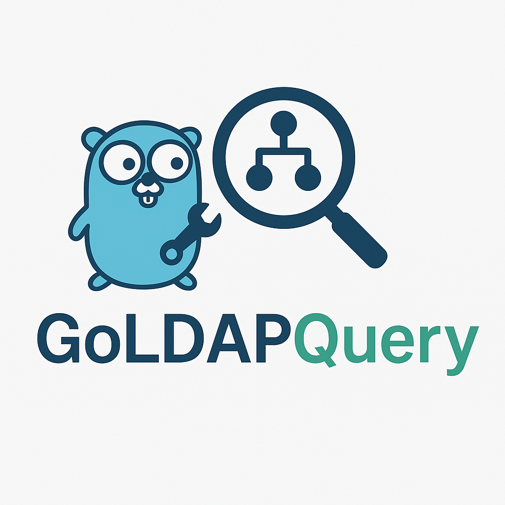

# GoLDAPQuery 
  
Not to be confused with GOLD apquery, this is GoLDAPQuery

## What's it for?
This tool is intended to simplify searching LDAP for various objects.  
It will support multiple operating systems out of the box, thanks to it being written in Go.   
Using ldapsearch is somewhat of a drag and I was hoping to provide a tool  
for those so inclined to perform raw ldapsearches that isn't a complete nightmare to use.  
The user of the tool will need to know certain details to use it of course, like the ldap server,  
have an understanding of what bind methods are supported on the endpoint, basedn,and knowledge of valid creds,etc.

## Initial features:   
- [x] Prompt for user creds  
- [x] Changing a user's password   
- [x] Creation of user accounts
- [x] Creation of machine accounts
    - Research why only my DA can do this
- [x] Deletion of User and Machine accounts
- [ ] Expand ldapsearch function to take all supported parameters, currently just filter, attributes, basedn, and scope  
- [ ] Store creds in environment variable  
- [x] Refactor
    - [x] Create Library
    

- [x] Search and list specific types of objects  
    - [x] Domain Controllers
    - [x] computers  
    - [x] users  
    - [x] groups
    - [x] kerberoastable users
    - [x] user specified
    - [x] Unconstrained ,Constrained Delegation and RBCD
    - [x] Shadow Credentials
    - [x] Protected Users Group
    - [x] Kerberos Pre-Authenticated Disabled
    - [x] Users who dont require a password
    - [x] Users set to require password change at next login
    - [x] Users set to have the password never expire
    - [ ] Pull down schema - need to research this more, I can pull down the top level, beyond that is HUUUUUGE and am limited by LDAP itself
    - [x] Query description field of all objects
    - [x] Query ms-DS-MachineAccountQuota

- [ ] Support different bind types, Anonymous, Simple Bind, GSSAPI, and SASL  
    - [x] anonymous  
    - [x] simple  
    - [x] ntlm  
    - [x] ntlm with PTH  
    - [ ] GSSAPI, support for this seems barely functional at best, need to research
    - [ ] SASL  
- [ ] Support dumping the entire database  
- [x] Support ldaps and ldap  

## Stretch goals

- Allow for deletion, and modification of existing LDAP entries  
- Potentially support BloodHound(Need to look into this more)  
