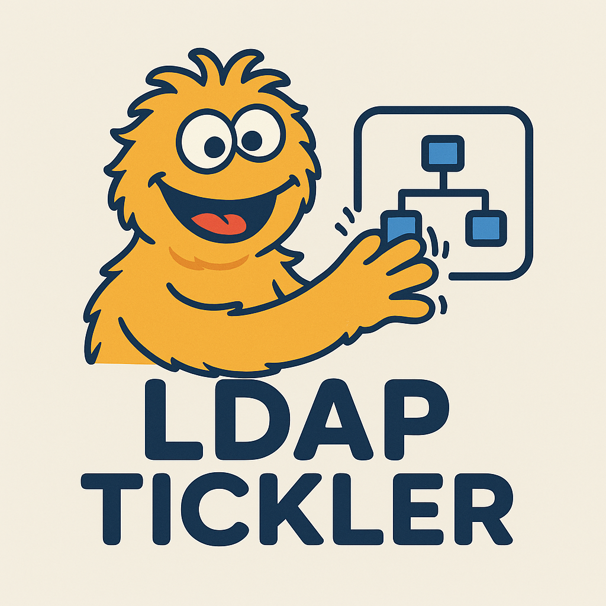

# LDAPtickler
  
Tickler of LDAP


## What's it for?
This tool is intended to simplify searching LDAP for various objects.  
It will support multiple operating systems out of the box, thanks to it being written in Go.   
Using ldapsearch is somewhat of a drag and I was hoping to provide a tool  
for those so inclined to perform raw ldapsearches that isn't a complete nightmare to use.  
The user of the tool will need to know certain details to use it of course, like the ldap server,  
have an understanding of what bind methods are supported on the endpoint, basedn,and knowledge of valid creds,etc.

This tool has grown significantly to also allow for modification of certain fields that may be useful to a Red Team operator,
as well as the incorporation of many queries for spot checking the configuration of many AD attributes.   
This has been tested extensively against Windows 2025 Server running Active Directory.  
Be extremely careful when arbitrarily modifying or deleting entries in AD, it can lead to all sorts of unexpected behavior.
I personally have destroyed my domain a few times now leveraging this tool. 

This was mainly a research project to better understand AD internals in an LDAP database.    
Also attempts at learning how to manipulate specific fields and trying to understand some of the more esoteric parts of AD.  


## Example Usage:
```
go run ./cmd/ldaptickler/main.go -h 
Usage: /tmp/go-build620944892/b001/exe/main [OPTIONS] <arg>

DESCRIPTION
    A tool to simplify LDAP queries because it sucks and is not fun

OPTIONS
    -a, --attributes=STRING    Specify attributes for LDAPSearch, ex
                               samaccountname,serviceprincipalname. Usage of
                               this may break things
    -b, --basedn=STRING        Specify baseDN for query, ex. ad.sostup.id would
                               be dc=ad,dc=sostup,dc=id
        --dc=STRING            Identify domain controller
    -d, --domain=STRING        Domain for NTLM bind
    -f, --filter=STRING        Specify your own filter. ex.
                               (objectClass=computer)
    -g, --gssapi               Enable GSSAPI and attempt to authenticate
    -h, --help                 Display this help message.
        --insecure             Use ldap:// instead of ldaps://
    -p, --password             Password to bind with, will prompt
        --pth=STRING           Bind with password hash, WHY IS THIS SUPPORTED
                               OTB?!
        --scope=INT            Define scope of search, 0=Base, 1=Single Level,
                               2=Whole Sub Tree, 3=Children, only used by filter
                               and objectquery
    -s, --skip                 Skip SSL verification
    -u, --user=STRING          Username to bind with

Supported Utility Commands
    addmachine <machinename> <machinepass>                 Adds a new machine to
                                                           the domain
    addmachinelp <machinename> <machinepass>               Adds a new machine
                                                           using low-priv
                                                           credentials
    addspn <accountname> <spn>                             Adds an SPN to an
                                                           account
    adduser <username> <password>                          Creates a new user
    changepassword <accountname> <newpassword>             Changes the password
                                                           for an account
    deleteobject <objectname>                              Deletes an object
                                                           from the directory
    disablemachine <machinename>                           Disables a machine
                                                           account
    disableconstraineddelegation <accountname>             Disables constrained
                                                           delegation for an
                                                           account
    disablespn <accountname> <spn>                         Removes an SPN from
                                                           an account
    disableunconstraineddelegation <accountname>           Disables
                                                           unconstrained
                                                           delegation for an
                                                           account
    disableuser <username>                                 Disables a user
                                                           account
    enableconstraineddelegation <accountname> <service>    Enables constrained
                                                           delegation for an
                                                           account
    enablemachine <machinename>                            Enables a machine
                                                           account
    enablespn <accountname> <spn>                          Adds an SPN to an
                                                           account
    enableunconstraineddelegation <accountname>            Enables unconstrained
                                                           delegation for an
                                                           account
    enableuser <username>                                  Enables a user
                                                           account
                                                           

Supported LDAP Queries
    certpublishers             Returns all Certificate Publishers in the domain
    computers                  Lists all computer objects in the domain
    constraineddelegation      Lists accounts configured for constrained
                               delegation
    dnsrecords                 Returns DNS records stored in Active Directory
    domaincontrollers          Lists all domain controllers in the domain
    groups                     Lists all security and distribution groups
    groupswithmembers          Lists groups and their associated members
    kerberoastable             Finds accounts vulnerable to Kerberoasting
    machineaccountquota        Displays the domain's MachineAccountQuota setting
    nopassword                 Lists accounts with empty or missing passwords
    objectquery                Performs a raw LDAP object query
    passworddontexpire         Lists accounts with 'Password Never Expires' set
    passwordchangenextlogin    Lists accounts that must change password at next
                               login
    protectedusers             Lists members of the Protected Users group
    preauthdisabled            Lists accounts with Kerberos pre-authentication
                               disabled
    querydescription           Displays descriptions for supported LDAP queries
    rbcd                       Lists accounts configured for Resource-Based
                               Constrained Delegation (RBCD)
    schema                     Lists schema objects or extended attributes
    shadowcredentials          Lists users with shadow (msDS-KeyCredential)
                               credentials
    unconstraineddelegation    Lists accounts with unconstrained delegation
                               enabled
    users                      Lists all user accounts in the domain
    whoami                     Runs a whoami-style LDAP query for the current
                               user
                               

AUTHORS
    Chris Hodson r2d2@sostup.id
```

## List users
```
-d = Domain
-g = Enable GSSAPI
-dc = Specify DC
-s = Use TLS
-u = username
-p = prompt for password
users = query users in LDAP
```
```
go run ./cmd/ldaptickler/ -d targetdomain.com -g --dc tip.spinninglikea.top -basedn DC=spinninglikea,DC=top -s -u lowprivguy -p users
[+] Enter Password:
[+] Attempting GSSAPI bind to tip.spinninglikea.top
[+] Successfully connected to tip.spinninglikea.top
[+] Searching for all users in LDAP with baseDN DC=spinninglikea,DC=top
  DN: CN=Administrator,CN=Users,DC=spinninglikea,DC=top
    sAMAccountName: [Administrator]
  DN: CN=Guest,CN=Users,DC=spinninglikea,DC=top
    sAMAccountName: [Guest]
  DN: CN=krbtgt,CN=Users,DC=spinninglikea,DC=top
    sAMAccountName: [krbtgt]
  DN: CN=slacker,CN=Users,DC=spinninglikea,DC=top
    sAMAccountName: [slacker]
  DN: CN=No Inter.,CN=Users,DC=spinninglikea,DC=top
    sAMAccountName: [Nointer]
  DN: CN=lowprivguy,CN=Users,DC=spinninglikea,DC=top
    sAMAccountName: [lowprivguy]
```

## Initial features:   
- [x] Prompt for user creds  
- [x] Changing a user's password   
- [x] Creation of user accounts
- [x] Modification of Service Principal Names
- [x] Creation of machine accounts
    - [x] Research why only my DA can do this. This is now sorted out. This very much depended on the specific entries being created for the machine account.
- [x] Deletion of User and Machine accounts
- [x] Expand ldapsearch function to take all supported parameters, currently just filter, attributes, basedn, and scope  
- [ ] Store creds in environment variable  
- [x] Refactor
    - [x] Create Library
- [ ] Support Adding and removing of all delegation attributes  
    - [x] Unconstrained - Refactored
    - [x] Constrained  - Refactored
    - [x] Resource Based Constrained Delegation, support has been added for validation, adding and removing. Remove only supports all for now. Need to fix.   
- [ ] Support modification of msds-keycredentiallink for shadow credentials  
    - [ ] Create self signed cert  
    - [ ] Prepare blob for placement in msds-keycredentiallink field  
    - [ ] Modify msds-keycredentiallink field   
- [ ] Support creation of DNS entires
- [x] Search and list specific types of objects  
    - [x] Partial support for most useful DNS entries, many other types need work
    - [x] Domain Controllers
    - [x] DNS entries
    - [x] computers  
    - [x] users  
    - [x] groups
    - [x] kerberoastable users
    - [x] user specified
    - [x] Unconstrained ,Constrained Delegation and RBCD
    - [x] Shadow Credentials
    - [x] Protected Users Group
    - [x] Kerberos Pre-Authenticated Disabled
    - [x] Users who dont require a password
    - [x] Users set to require password change at next login
    - [x] Users set to have the password never expire
    - [ ] Pull down schema - need to research this more, I can pull down the top level, beyond that is HUUUUUGE and am limited by LDAP itself
    - [x] Query description field of all objects
    - [x] Query ms-DS-MachineAccountQuota

- [ ] Support different bind types, Anonymous, Simple Bind, GSSAPI, and SASL  
    - [x] anonymous  
    - [x] simple  
    - [x] ntlm  
    - [x] ntlm with PTH  
    - [x] GSSAPI  
    - [ ] SASL  
- [ ] Support dumping the entire database  
- [x] Support ldaps and ldap  


## Stretch goals

- [x] Allow for deletion, and modification of existing LDAP entries  
- Potentially support BloodHound(Need to look into this more)  


## Updates
Fixed issue when setting UserAccountControl for machine accounts. Before I was just blowing away the prior setting and replacing.  
It was determined this was silly. Now grabbing the previous UAC setting and doing bit math to add the desired setting.  
This paves the way to do the same for user accounts.    
GSSAPI is now implemented thanks to the latest PRs to the go-ldap package.


## Thanks
### This wouldnt be possible without the following people:  
- [mjwhitta](https://github.com/mjwhitta/)     
- [dumpst3rfir3](https://github.com/dumpst3rfir3/)   
- [sludgework](https://github.com/sludgework)  

### Without the below package none of this would be possible
- [go-ldap](https://github.com/go-ldap/ldap)  
- [gokrb5](github.com/jcmturner/gokrb5/v8)